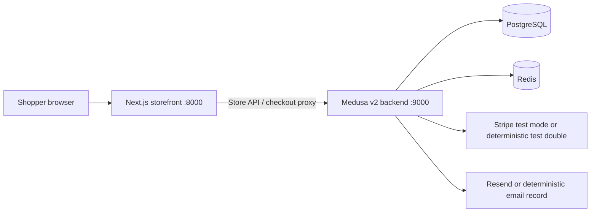
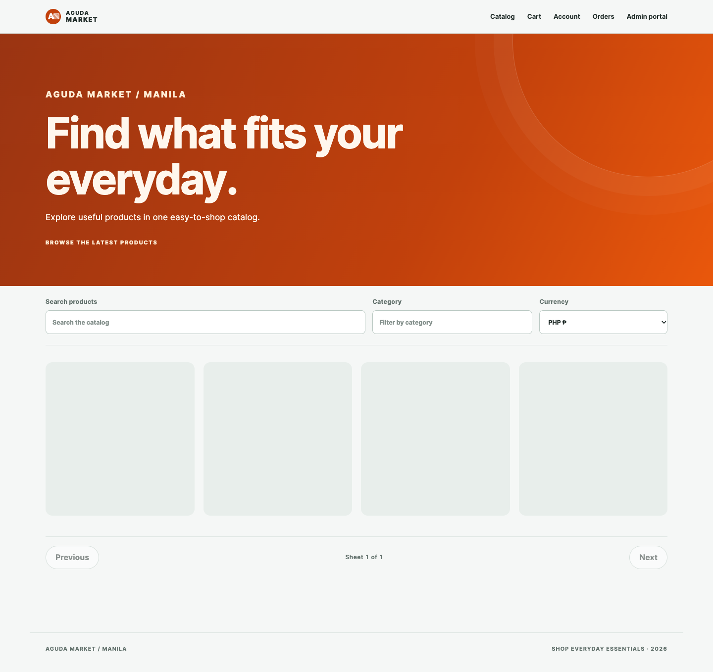

# AGUDA Market (ecommerce)

AGUDA Market is a general marketplace ecommerce: a clean, fast storefront
for useful everyday products that a small business could launch with. This repo
documents and verifies the implemented scope; live external
provider delivery remains explicitly outside this milestone.

## DevSecOps pointer

- [`platform/README.md`](platform/README.md) documents platform and DevSecOps architecture, validation, recovery, and operational boundaries.
- Live URL: Not deployed.

## What is implemented

- Medusa v2 catalog backed by an idempotent seed of three published products,
  PHP/USD prices, inventory, search, category filtering, pagination, and empty
  states.
- Native Medusa carts with server-calculated totals, inventory-aware line items,
  and storefront cart states.
- Customer registration/sign-in, sign-out, Redis-backed auth attempt limits,
  and customer-owned paginated order history/detail pages.
- Authenticated checkout preparation with PH/US address validation, shipping
  options, zero tax, native payment collection, and verified Stripe webhook
  completion boundaries.
- Deterministic Stripe and Resend test doubles for local checkout verification,
  including idempotent payment-event and order-paid-email records.
- Accessible Next.js storefront states and redacted structured logging with
  correlation IDs.

The local admin demo uses Medusa's native dashboard. It includes a shell-only
bootstrap command, authenticated dashboard access, product CRUD and publishing,
category/price/inventory editing, local image uploads, and order fulfillment
transitions. Docker Compose also provides the production-shaped local demo,
including a complete checkout, payment, email, fulfillment, and persistence
verification path using deterministic local provider doubles.

## Docker demo

Docker Desktop and registry access for the pinned base images are the only
prerequisites. Copy `.env.docker.example` to `.env.docker` once, then this is a
one-command demo:

```sh
docker compose --env-file .env.docker up --build
```

The default demo admin credentials are `admin@example.invalid` /
`local-demo-admin-change-me` (change them in `.env.docker` for anything beyond
local evaluation).
The storefront is `http://localhost:8000`, backend health is `http://localhost:9000/health`,
and native admin is `http://localhost:9001/app`. Defaults use deterministic Stripe/Resend
doubles; real providers are opt-in. Data persists in project-scoped named volumes; reset
only this demo with `docker compose --env-file .env.docker down -v`.

## Architecture



## Prerequisites

- Node.js with Corepack enabled
- pnpm 10.17.1 (the repository uses Corepack)
- PostgreSQL running locally with a database and role matching `DATABASE_URL`
- Redis running locally

## Local setup

From the repository root:

```sh
corepack enable
corepack pnpm install
cp .env.example .env
```

Edit `.env`. For the deterministic local demo, keep
`PAYMENT_PROVIDER_MODE=test-double`; replace `JWT_SECRET` and `COOKIE_SECRET`
with random values of at least 32 characters. Start PostgreSQL and Redis using
your local installation. Export the file for the command-line tools, then
validate and initialize Medusa:

```sh
set -a; . ./.env; set +a
corepack pnpm validate:env
corepack pnpm --filter @ecommerce/backend exec medusa db:migrate
corepack pnpm --filter @ecommerce/backend seed:catalog
```

`NEXT_PUBLIC_MEDUSA_PUBLISHABLE_API_KEY` is required by the storefront and is
sent as the browser-visible `x-publishable-api-key` header. Publishable keys are
not secrets; do not put a secret provider token in this variable. The value is
read from the local environment and is never printed or committed. Keep `.env`
and `apps/storefront/.env.local` untracked.

Start both applications in one terminal:

```sh
corepack pnpm dev
```

The storefront is `http://localhost:8000`; the backend is
`http://localhost:9000`. Alternatively, start them independently with
`corepack pnpm --filter @ecommerce/backend dev` and
`corepack pnpm --filter @ecommerce/storefront dev`.

## Checkout provider modes

### Deterministic local test double

With `PAYMENT_PROVIDER_MODE=test-double`, sign in, add a seeded product to a
cart, open checkout, and submit a valid PH or US address. The backend returns a
stable `pi_test_<cart-id>` contract and authorizes the native payment session
without contacting Stripe. Webhook tests use the local signature seam and the
Resend test double records the order-paid lifecycle in PostgreSQL. Set
`RESEND_TEST_DOUBLE_FAILURE=1` to exercise the isolated email-failure path.

### Stripe test mode and Resend

After supplying real test credentials in `.env`, set
`PAYMENT_PROVIDER_MODE=stripe` and provide `STRIPE_SECRET_KEY`,
`STRIPE_PUBLISHABLE_KEY`, and `STRIPE_WEBHOOK_SECRET`. Run the app, expose the
backend to Stripe CLI, and forward signed events to the webhook endpoint:

```sh
stripe listen --forward-to localhost:9000/payments/webhooks/stripe
```

Use Stripe test cards only. To enable live Resend API calls, provide
`RESEND_API_KEY` and a verified `RESEND_FROM` address. The demo currently sends
only the order-paid confirmation; this documentation does not claim provider
delivery.

## Demo limitations

- This is a local MVP demo, not a claim of full P0 completion.
- Tax is currently zero and shipping is limited to the implemented PH/US
  options.
- Checkout requires a signed-in customer.
- Administration uses Medusa's native dashboard and admin APIs at `/app` and
  `/admin`; the storefront `/admin` entry point redirects there. Product CRUD,
  publishing, categories/prices/inventory, local image uploads, and order
  fulfillment transitions are native Medusa operations in the local demo.
- Live Stripe payment and Resend delivery require real credentials, verified
  provider setup, and external callbacks; local doubles prove the local
  integration boundaries.
- Fresh Docker builds require registry access to the exact pinned Node base
  image (`node:22.14.0-bookworm-slim`); use an already cached pinned image if
  the registry is temporarily unavailable, rather than changing the pin.

## Tests and quality checks

### Local admin bootstrap

With PostgreSQL/Redis running and the root `.env` loaded, create a local admin
without committing credentials (the variables are shell-only):

```sh
set -a; . ./.env; set +a
read -r ADMIN_EMAIL
read -rs ADMIN_PASSWORD; echo
ADMIN_EMAIL="$ADMIN_EMAIL" ADMIN_PASSWORD="$ADMIN_PASSWORD" \
  corepack pnpm --filter @ecommerce/backend admin:bootstrap
```

Sign in at `http://localhost:9001/app` in the Docker demo (or `:9000/app` for
the local single-process setup). Native admin authorization rejects
anonymous and shopper sessions; no email delivery is part of this demo.

The preserved CSV contains TC-001 through TC-420. The run is
fail-fast and uses isolated local ports. The Ticket 11 backend business-logic
coverage report is 88.88% statements, 86.79% branches, 100% functions, and
91.66% lines; these figures exclude live provider adapters and do not claim
live Stripe or Resend delivery:

```sh
set -a; . ./.env; set +a
P0_API_URL=http://127.0.0.1:19308 P0_WEB_URL=http://127.0.0.1:19307 \
  corepack pnpm exec playwright test --config=playwright.config.ts \
  --max-failures=1 --grep='TC-(00[1-9]|0[1-9][0-9]|1[0-2][0-9]|13[0-9]|140|19[7-9]|20[0-9]|210)'
corepack pnpm lint
corepack pnpm typecheck
corepack pnpm build
corepack pnpm validate:env
corepack pnpm health
```

`corepack pnpm test:ticket11` loads only the non-secret publishable key from
ignored local env files for the isolated browser run; shell-provided values
remain authoritative. It allocates backend and storefront ports dynamically.
The storefront `/admin` entry point also resolves its admin destination from
the configured backend URL rather than a hard-coded origin.

## Security and logging

Never commit `.env`, provider credentials, card data, passwords, addresses, or
PII. The webhook verifies the raw request body and timestamped signature before
mutating commerce state. Logs are structured and redact sensitive payloads;
correlation IDs are returned on API boundaries. Liveness (`/health`) is
separate from dependency readiness (`/health/ready`), and readiness exposes
only boolean dependency status.

## Project files

- `apps/backend` — Medusa v2 backend, checkout seams, health checks, and seed
- `apps/storefront` — Next.js shopper experience
- `docs/test-cases/ecommerce-p0.csv` — preserved P0 test inventory
- `docs/platform-foundation.md` — local service foundation notes
- `MVP.md` — sealed user-provided product requirements document

## Ticket 12 verification

`corepack pnpm validate:csv` verifies all 420 CSV rows, unique IDs, and
traceability links. `corepack pnpm test:p0:all` runs the full fail-fast suite on
isolated local ports. CI repeats environment validation, CSV validation,
migration, seed, backend coverage (70% minimum), lint, typecheck, build, and
Playwright browser installation on PostgreSQL and Redis service containers. The GitHub workflow file is retained but is currently disabled manually server-side.
Stripe and Resend are deterministic local doubles in CI; failures upload
diagnostics without secrets.

## Screenshots and troubleshooting

Representative responsive catalog captures from the refreshed storefront, including the orange AGUDA Market hero:




These PNGs are optimized local captures; they contain no admin, customer, or
provider data. Never commit
`.env`, provider credentials, payment data, passwords, addresses, or PII.
Structured logs redact sensitive values and carry correlation IDs; local traces
are written outside the repository. If readiness fails, run `corepack pnpm
health` and check PostgreSQL/Redis. If environment validation fails, compare
`.env` with `.env.example` and use secrets of at least 32 characters. If
Playwright cannot start, run `corepack pnpm exec playwright install chromium`.
Docker Compose is a complete local order-flow demo. Fresh image builds require
registry access to the exact pinned Node base image; when that is unavailable,
use an already cached pinned base image rather than changing the Dockerfile pin.

The Admin entry point at `/app` redirects to its login screen. A harmless
`/cloud/auth` probe may return 404 in the local demo because Medusa Cloud is not
configured; it is optional and does not affect local administration. A benign
React hydration warning may appear while the dashboard initializes and is not a
demo failure.

## Contribution

This project is open for collaboration. If you wish to contribute:

    Fork the repository.
    Create a feature branch (git checkout -b feature/your-feature-name).
    Commit your changes (git commit -m 'Add your feature').
    Push to the branch (git push origin feature/your-feature-name).
    Open a pull request.

## Contact

For any questions or inquiries, please reach out to www.linkedin.com/in/agudatech/.

## Support

If you find this project helpful and would like to support its ongoing development, consider buying me a coffee! Your support helps me keep working on this project and developing more features.

[](https://www.buymeacoffee.com/mauriceague)
