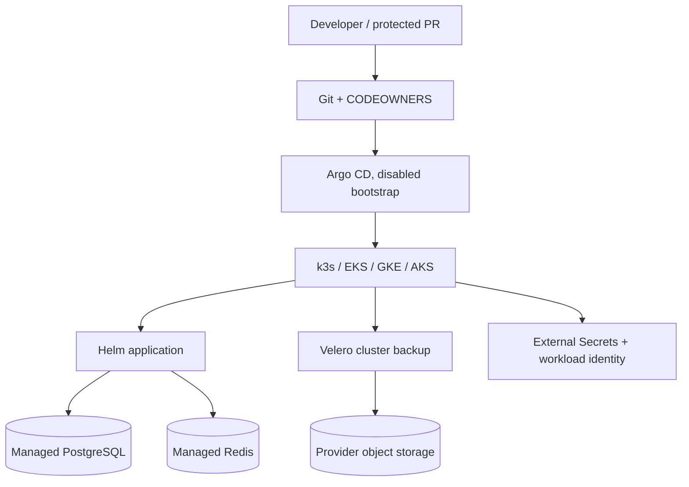
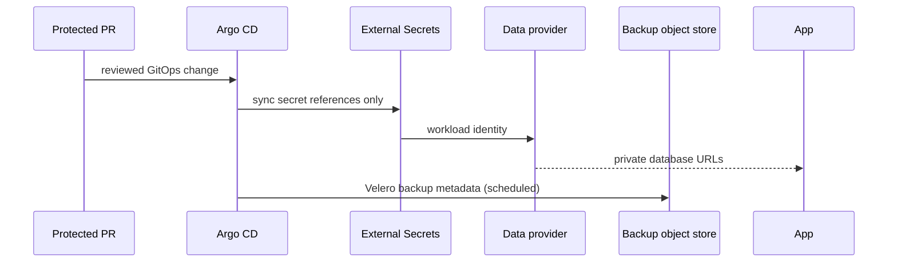

# DevSecOps platform

Live URL: **Not deployed**. These Terraform, Helm, GitOps, and recovery artifacts
are intentionally unprovisioned. Validation is local and does not contact a cloud,
cluster, GitHub policy, payment provider, or email provider.

## Architecture and choices



Managed PostgreSQL/Redis are the durable data boundary in cloud deployments;
provider-native encryption, private networking, HA, backup retention, and PITR
are preferred over an in-cluster database operator. k3s is explicitly
nonproduction and uses a 15-minute PostgreSQL dump contract to an external
S3-compatible target. Redis is a cache/session dependency, not a source of truth.
Velero protects Kubernetes state and PVC metadata, but does not replace database
backups. Alternatives rejected: committed credentials, static cloud keys,
public databases, self-managed production PostgreSQL, automatic production
apply, and a false claim that a restore drill ran.



## Repository layout

| Path | Contract |
|---|---|
| `terraform/modules/{aws,gcp,azure}` | private managed data, network, cluster, vault, registry, edge modules |
| `terraform/hetzner` | single-node, nonproduction k3s only |
| `charts/aguda-deskworks` | application, provider modes, ExternalSecret, k3s backup CronJob |
| `gitops` | disabled layer applications, environment targets, digest promotion |
| `secrets` | External Secrets provider overlays; no values |
| `recovery` | Velero templates, backup boundaries, runbook, evidence template |
| `observability` | Prometheus/Grafana/alerts and dashboards |
| `supply-chain` | image/signature/policy contracts |
| `cost` | dated planning ranges and official pricing links |
| `provider-doubles` | deterministic dev/k3s and fail-closed staging/prod behavior |

## Prerequisites and safe commands

Use Node/Corepack, pnpm, Docker Desktop, `kubectl`, Helm, Terraform, and (for
optional local validation) kind. No command below applies infrastructure.

```sh
corepack pnpm install --frozen-lockfile
corepack pnpm platform:validate
corepack pnpm validate:platform:refs
corepack pnpm test:platform:red
terraform -chdir=platform/terraform/hetzner init -backend=false
terraform -chdir=platform/terraform/hetzner validate
helm lint platform/charts/aguda-deskworks
helm template aguda platform/charts/aguda-deskworks -f platform/charts/aguda-deskworks/values-k3s.yaml
```

Local application behavior remains in the root app documentation history; this
platform README is the canonical platform entry point. For Docker, use the
repository’s compose file. For kind, create a disposable cluster and run
`kubectl apply --dry-run=client -f platform/recovery/velero`; for k3s, use the
Hetzner Terraform subtree only after an authorised operator supplies ignored
variables and separately secured state. Cloud commands are deliberately limited
to `terraform init`, `validate`, and operator-reviewed `plan`; this checkout does
not run `apply`.

## Access, secrets, and GitOps

Production access is private-network/VPN or a controlled bastion; admin remains
private. Provider identity is OIDC/workload identity (AWS IRSA, GCP Workload
Identity, Azure federated identity). External Secrets reads provider vault refs;
the repo contains names and placeholders only. Dev/k3s use deterministic Stripe
and Resend doubles. Staging/prod require real ExternalSecret refs and fail closed
if provider modes or references are missing. Existing application behavior sends
only the order-paid confirmation; no shipped-email feature is added here.

Argo layers are disabled until a separately approved bootstrap. Promotion uses
immutable image digests for staging/prod. Renovate groups updates monthly and
never automerges. Configure GitHub branch protection and required `platform`
Environment reviewers/status checks in GitHub by an administrator; this repo
documents the requirement but does not claim server-side configuration.

GitHub CI state is externally configured and not repository-provable. Last
verified against the actual GitHub configuration on **2026-10-04**: workflow
files and required-check names are present in this checkout, but branch
protection, Environment reviewers, variables, OIDC trust, and workflow
enabled/disabled state must be checked in GitHub by an administrator. No
server-side GitHub setting was changed here. Ownership rules are documented in
`.github/CODEOWNERS` (compatibility copy: `CODEOWNERS`); dependency update policy
is documented in `renovate.json` and is monthly, grouped, and non-automerge.

## Observability and recovery

Structured application logs carry correlation IDs and redact sensitive values.
Prometheus metrics, readiness, alerts, and Grafana dashboards live under
`observability/`. Provider PostgreSQL backups use 14-day defaults, PITR where the
provider supports it, encryption, and deletion protection. Redis uses provider
HA/encryption and snapshot retention where supported; Redis recovery is bounded
by cache/session semantics. Velero’s disabled template targets private object
storage through workload identity with a 35-day schedule/retention example.

The service boundary is RPO **15 minutes** and RTO **4 hours**, not a guarantee:
provider PITR granularity, object-store lag, single-node k3s, restore capacity,
and Redis cache semantics are caveats. Run the quarterly drill using
`recovery/restore-verification-runbook.md` and record only actual results in
`recovery/restore-evidence-template.md`. No restore has been executed by this
repository.

## Troubleshooting and rollback

- Helm fails on staging/prod: verify `providerVaultKeys`, ExternalSecret names,
  ClusterSecretStore health, and real provider modes; do not add fallback values.
- Readiness fails: inspect dependency status and provider-private DNS/routes,
  without printing URLs or secret values.
- Backup fails: stop teardown, preserve the source, inspect job events and object
  store identity, then rerun only after approval.
- Rollback: pause GitOps sync, restore the previously approved image digest and
  values, validate readiness, and record the change. Database rollback is a
  forward-compatible restore decision, not an automatic destructive migration.

## Cost and ownership

See [`cost/README.md`](cost/README.md) for 2026-10-04 ranges, assumptions,
exclusions, and official links. `@mauricechesteraguda` owns platform paths per
the verified repository origin; production operations require a separately named
operator and approver in the deployment record.

## Update instructions

Update provider versions and chart locks through reviewed Renovate PRs. Update
cost ranges when pricing, region, or architecture assumptions change. Update
restore evidence after each quarterly drill, never pre-populate it as proof.
When deployment is genuinely reachable, replace the live-URL line with the
environment, URL, date checked, and owner; until then retain **Not deployed**.
