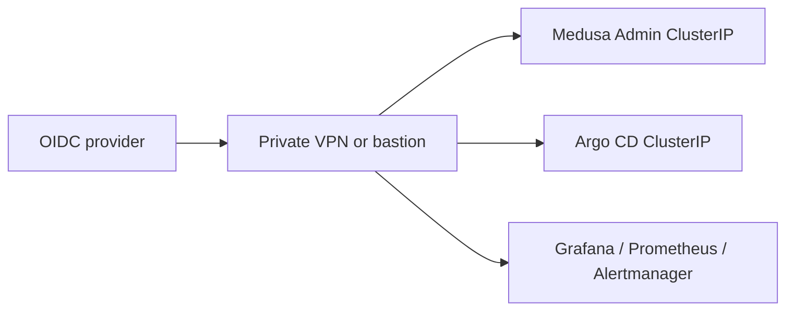

# Private administration

Medusa Admin, Argo CD, Grafana, Prometheus, and Alertmanager remain `ClusterIP` and have no
public hostname. A future private ingress must require OIDC and private/VPN routing. The safe
fallback is `kubectl -n <namespace> port-forward svc/<service> <local>:<port>`.

## Status and architecture

Live URL: **Not deployed**. This subtree is an unprovisioned contract; repository validation does not contact providers or apply infrastructure.

The canonical operational context, safety/no-apply stance, ownership, recovery
boundaries, and update instructions are in [`platform/README.md`](../README.md)
(or `../../README.md` for nested Terraform modules). No diagram here is evidence
of a live deployment.
