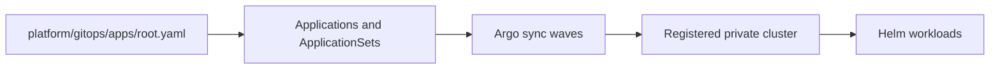

# Argo CD compatibility entry point

<!-- gitops-10042026-Maurice: canonical manifests live in platform/gitops; this pointer preserves the platform contract path. -->

Ticket 05 intentionally keeps one GitOps tree. Use `platform/gitops/apps/root.yaml`
as the bootstrap Application, `platform/gitops/applicationsets/targets.yaml` for
generated targets, and `platform/gitops/bootstrap/values.yaml` for Helm bootstrap
values. No credentials are stored at this compatibility path.

## Status and architecture

Live URL: **Not deployed**. This subtree is an unprovisioned contract; repository validation does not contact providers or apply infrastructure.

The canonical operational context, safety/no-apply stance, ownership, recovery
boundaries, and update instructions are in [`platform/README.md`](../README.md)
(or `../../README.md` for nested Terraform modules). No diagram here is evidence
of a live deployment.
