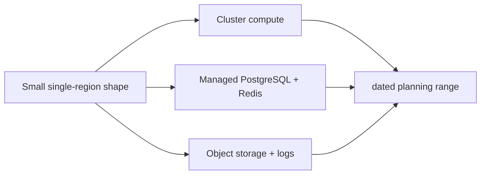

# Cost envelope (planning only)

Prices change frequently. The ranges below are **USD/month, checked 2026-10-04**
for a small single-region nonproduction shape (one small Kubernetes node, managed
PostgreSQL, managed Redis, object storage, logs, and modest egress). They are
planning ranges, not quotes; taxes, support, domains, high egress, backups beyond
included allowances, HA/replicas, NAT gateways, commercial observability, and
provider discounts are excluded.

| Provider | Current planning range | Assumptions/caveat |
|---|---:|---|
| Hetzner | $20–$75 | k3s nonproduction VM plus volumes/object storage; managed PostgreSQL/Redis are not assumed available in this shape |
| AWS | $180–$650 | small EKS/control-plane and RDS/ElastiCache private deployment; NAT and multi-AZ can dominate |
| GCP | $170–$600 | small GKE, Cloud SQL, Memorystore, private networking; egress and Cloud NAT excluded |
| Azure | $220–$750 | small AKS, PostgreSQL Flexible Server, Azure Cache for Redis; private endpoints and support excluded |

Official pricing sources: [Hetzner cloud](https://www.hetzner.com/cloud/),
[AWS EKS](https://aws.amazon.com/eks/pricing/), [AWS RDS](https://aws.amazon.com/rds/postgresql/pricing/),
[AWS ElastiCache](https://aws.amazon.com/elasticache/redis/pricing/),
[GCP GKE](https://cloud.google.com/kubernetes-engine/pricing),
[Cloud SQL](https://cloud.google.com/sql/pricing), [Memorystore](https://cloud.google.com/memorystore/pricing),
[Azure AKS](https://azure.microsoft.com/pricing/details/aks/),
[Azure PostgreSQL](https://azure.microsoft.com/pricing/details/postgresql/flexible-server/), and
[Azure Cache](https://azure.microsoft.com/pricing/details/cache/).

No provider API was queried and no spend was incurred by repository validation.

## Status and architecture

Live URL: **Not deployed**. This subtree is an unprovisioned contract; repository validation does not contact providers or apply infrastructure.

The canonical operational context, safety/no-apply stance, ownership, recovery
boundaries, and update instructions are in [`platform/README.md`](../README.md)
(or `../../README.md` for nested Terraform modules). No diagram here is evidence
of a live deployment.
