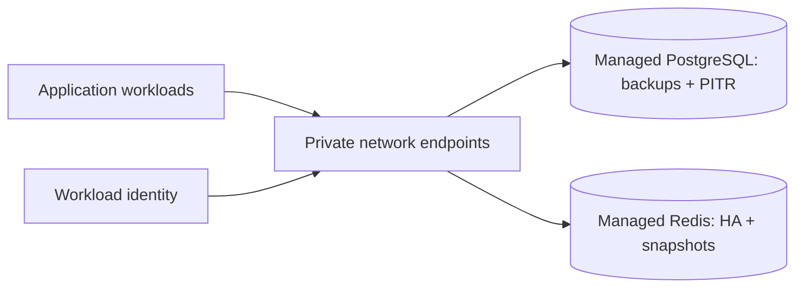

# Managed data boundary

PostgreSQL and Redis are provider-native, private-network resources under the `data`
modules for AWS, GCP, and Azure. Defaults enable encryption in transit/at rest,
multi-zone/HA where supported, private endpoints, backups, retention, and deletion
protection. Credentials are sensitive inputs supplied out-of-band.

## Status and architecture

Live URL: **Not deployed**. This subtree is an unprovisioned contract; repository validation does not contact providers or apply infrastructure.

The canonical operational context, safety/no-apply stance, ownership, recovery
boundaries, and update instructions are in [`platform/README.md`](../README.md)
(or `../../README.md` for nested Terraform modules). No diagram here is evidence
of a live deployment.
