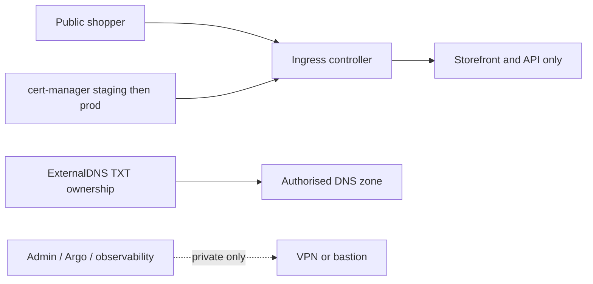

# Public edge

Install official, pinned charts only: ingress-nginx `4.11.3`, external-dns `1.15.0`,
cert-manager `v1.16.2`. Values must provide the actual domain, DNS zone, and provider identity;
there are no public hostname defaults. ExternalDNS uses TXT ownership with owner ID
`aguda-${ENVIRONMENT}` and cloud-specific workload identity (AWS Route53 IRSA, GCP DNS
Workload Identity, Azure DNS Workload Identity). Use `letsencrypt-staging` until a DNS/TLS
validation has passed, then explicitly promote to `letsencrypt-prod`.

Only storefront and API are public. Admin, Argo CD, Grafana, Prometheus, and Alertmanager have
no public Ingress; use VPN/private ingress with OIDC-ready auth or `kubectl port-forward`.
Render-time validation must reject empty `domainFilters`, `acmeEmail`, and provider identity.
DNS writes are limited to the configured zone and TXT ownership record; no wildcard or
catch-all record is generated.

## Status and architecture

Live URL: **Not deployed**. This subtree is an unprovisioned contract; repository validation does not contact providers or apply infrastructure.

The canonical operational context, safety/no-apply stance, ownership, recovery
boundaries, and update instructions are in [`platform/README.md`](../README.md)
(or `../../README.md` for nested Terraform modules). No diagram here is evidence
of a live deployment.
