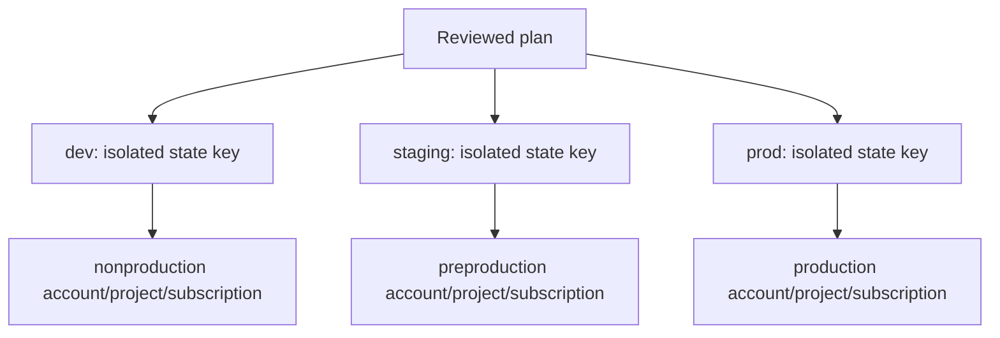

# Environment examples

`dev`, `staging`, and `prod` are separate state keys and should use separate cloud
accounts/projects/subscriptions for production. Nonproduction may share a cloud
account only when network, identity, state key, and data resources remain isolated.
The examples contain placeholders only; provide credentials through provider-native
OIDC or local environment authentication.

## Status and architecture

Live URL: **Not deployed**. This subtree is an unprovisioned contract; repository validation does not contact providers or apply infrastructure.

The canonical operational context, safety/no-apply stance, ownership, recovery
boundaries, and update instructions are in [`platform/README.md`](../README.md)
(or `../../README.md` for nested Terraform modules). No diagram here is evidence
of a live deployment.
