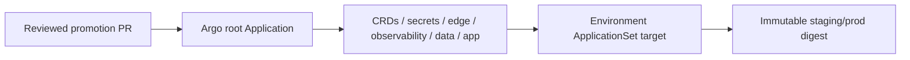

# GitOps delivery contract

<!-- gitops-10042026-Maurice: one generator-backed delivery graph; credentials stay in Argo/cluster SecretRefs. -->

This directory is the reviewable, credential-free Argo CD contract for Ticket 05.

- `bootstrap/values.yaml` is the Argo CD Helm bootstrap configuration. It enables
  workload identity/RBAC integration without embedding a cluster credential.
- `apps/root.yaml` is the app-of-apps root. Its children are ordered with sync
  waves: CRDs/controllers, secrets, edge, observability, data, then workloads.
- `applicationsets/targets.yaml` uses one list generator for Hetzner dev and the
  AWS/GCP/Azure dev/staging/prod targets. Destination server values are cluster
  registration names, never bearer tokens or kubeconfigs.
- `promotion/*.yaml` is the immutable promotion interface. Staging and prod
  require a 64-hex SHA-256 digest and an explicit predecessor; only dev may
  carry a mutable tag. Promotion is a reviewed PR, not an Argo image updater.

Shared-nonprod targets may share an account only when Terraform supplies separate
network, identity, state key, and data boundaries. Production targets must use a
different account/project/subscription and cluster registration. Secrets are
referenced by External Secrets/cluster SecretRefs and are intentionally absent
from this repository.

The `future-*` component Applications are disabled placeholders. They make the
delivery graph explicit without pretending Ticket 06/07/08 controllers exist.

## Status and architecture

Live URL: **Not deployed**. This subtree is an unprovisioned contract; repository validation does not contact providers or apply infrastructure.

The canonical operational context, safety/no-apply stance, ownership, recovery
boundaries, and update instructions are in [`platform/README.md`](../README.md)
(or `../../README.md` for nested Terraform modules). No diagram here is evidence
of a live deployment.
