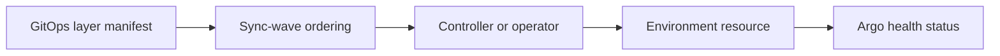

# Layer contract

<!-- gitops-10042026-Maurice: paths are intentionally empty until the owning tickets deliver controllers. -->

The root graph reserves these waves: `0` CRDs, `10` controllers, `20` secrets,
`30` edge, `40` observability, `50` data, and `60` application workloads.
Ticket 05 owns ordering and boundaries only; Ticket 06/07/08 own the actual
security and supply-chain controllers. No credentials or fake controllers are
committed here.

## Status and architecture

Live URL: **Not deployed**. This subtree is an unprovisioned contract; repository validation does not contact providers or apply infrastructure.

The canonical operational context, safety/no-apply stance, ownership, recovery
boundaries, and update instructions are in [`platform/README.md`](../../README.md)
(or `../../README.md` for nested Terraform modules). No diagram here is evidence
of a live deployment.
