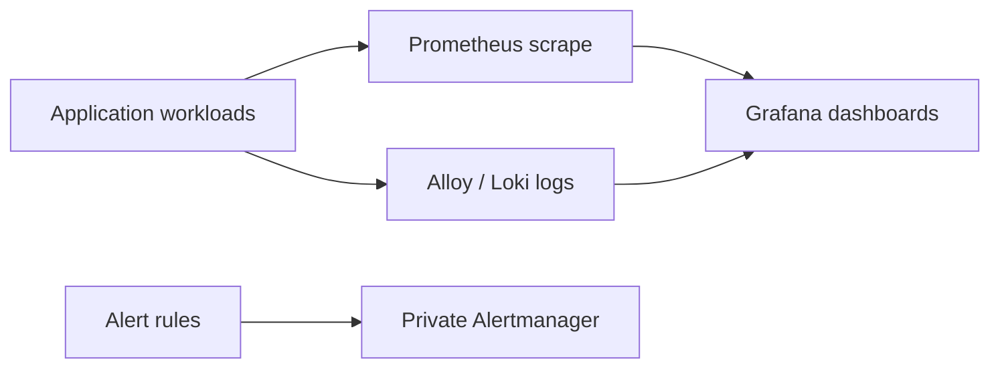

# Platform observability (Ticket 08)

Deployable, private-by-default configuration for kube-prometheus-stack, Loki, and Grafana Alloy. Versions and image tags are pinned in `values.yaml`; no component is exposed through an Ingress or LoadBalancer.

Nonproduction retains seven days and production fifteen days. Production uses two Prometheus, Grafana, and Alertmanager replicas where supported and persistent volumes. Alert receivers remain inert until ExternalSecret placeholders are wired to real values.

## Status and architecture

Live URL: **Not deployed**. This subtree is an unprovisioned contract; repository validation does not contact providers or apply infrastructure.

The canonical operational context, safety/no-apply stance, ownership, recovery
boundaries, and update instructions are in [`platform/README.md`](../README.md)
(or `../../README.md` for nested Terraform modules). No diagram here is evidence
of a live deployment.
