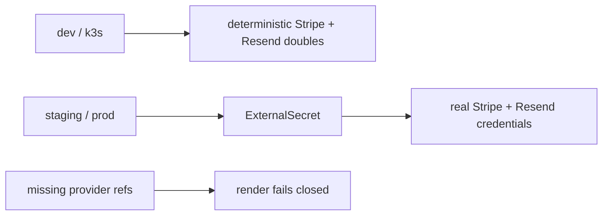

# Provider behavior contract

Live URL: **Not deployed**; this is a repository contract, not evidence of provider delivery.

`dev` and nonproduction `k3s` use `PAYMENT_PROVIDER_MODE=test-double` and
`EMAIL_PROVIDER_MODE=test-double`. The doubles are deterministic and do not call
external APIs. Staging and production use `stripe`/`resend`, and must receive
credentials through the provider `ClusterSecretStore` and ExternalSecret refs;
Helm rendering fails when those refs or modes are absent. The application’s
existing behavior sends only the order-paid confirmation; this platform change
does not add shipped-email behavior.
