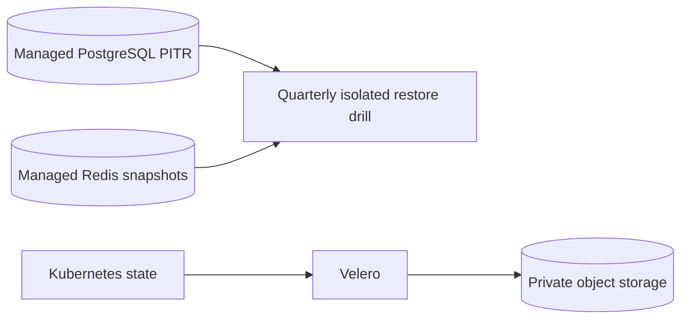

# Recovery boundary

Live URL: **Not deployed**. Managed data modules expose provider backup retention,
encryption, and point-in-time recovery settings. Velero and the k3s CronJob are
disabled examples. Restore tests and RPO/RTO evidence are operational activities;
no restore was executed by this repository. See the runbook and evidence template.

| Data class | Owner | Retention | Encryption | Recovery boundary |
|---|---|---:|---|---|
| Managed PostgreSQL | Platform/Data operator | 14 days default + provider PITR | provider KMS + TLS | RPO 15m target / RTO 4h target, provider caveats |
| Managed Redis | Platform/Data operator | 14 days where snapshots are supported | provider encryption + TLS | cache/session loss is acceptable; invalidate sessions |
| k3s PostgreSQL dump | Nonproduction operator | external bucket lifecycle, minimum 35 days | bucket SSE/KMS + TLS; identity, no static keys | 15m schedule target; single-node/object-store caveats |
| Kubernetes state/PVC metadata | Platform operator | Velero example 35 days | object-store provider encryption + TLS | restore into isolated cluster before cutover |
