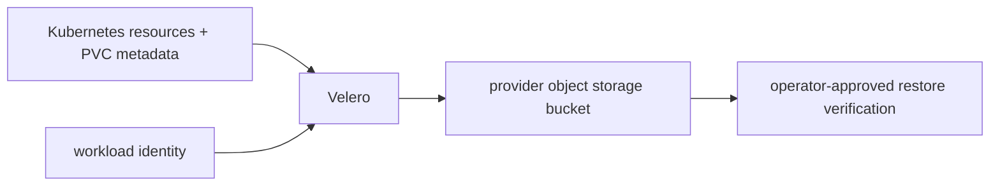

# Velero recovery contract

Live URL: **Not deployed**. The manifests are disabled examples and do not prove a backup or restore.

The `velero` Application and `BackupStorageLocation` below are provider-neutral
templates. Replace bucket, region, and identity annotations through an environment
overlay; never add access keys to Git. AWS IRSA, GCP Workload Identity, or Azure
workload identity supplies object-store access. Schedule is daily with 35-day
retention; database durability remains the managed provider’s responsibility.
