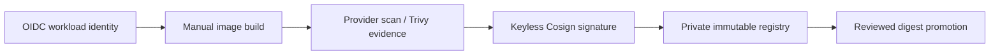

# Cloud-native registry interfaces

Use the provider registry modules under `platform/terraform/modules/{aws,gcp,azure}/registry`.
Repositories use immutable tags, scan-on-push or provider-native scanning, private
access, and workload-identity/OIDC CI authentication. Long-lived CI credentials are
not supported by these examples.

## Status and architecture

Live URL: **Not deployed**. This subtree is an unprovisioned contract; repository validation does not contact providers or apply infrastructure.

The canonical operational context, safety/no-apply stance, ownership, recovery
boundaries, and update instructions are in [`platform/README.md`](../README.md)
(or `../../README.md` for nested Terraform modules). No diagram here is evidence
of a live deployment.
