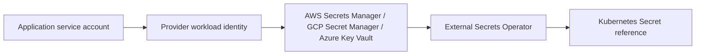

# External Secrets and workload identity

This layer is intentionally value-free. External Secrets Operator (ESO) is installed by
the CRD/controller sync wave; applications consume only `ExternalSecret` objects.

Trust flows:

* AWS: pod service account `aguda-secrets` -> EKS OIDC/IRSA role -> `secretsmanager:GetSecretValue`
  on the environment prefix only.
* GCP: Kubernetes service account -> Workload Identity binding -> Secret Manager accessor on
  named secrets only.
* Azure: Kubernetes service account -> Azure Workload Identity federated credential -> Key Vault
  Secrets User on the vault only.

Staging and production require `providerVaultKeys` and fail closed when absent. The k3s/dev
overlay uses deterministic, non-sensitive doubles only. To bootstrap local secrets, create the
provider-side entries from `secret-bootstrap.example.env` using an out-of-band shell, then
delete the local file; never put values in Git, Terraform variables, Helm values, or logs.

The ESO chart is pinned to `0.10.5` in the GitOps values. Change it only through a reviewed
Renovate update from the official external-secrets repository.

## Status and architecture

Live URL: **Not deployed**. This subtree is an unprovisioned contract; repository validation does not contact providers or apply infrastructure.

The canonical operational context, safety/no-apply stance, ownership, recovery
boundaries, and update instructions are in [`platform/README.md`](../README.md)
(or `../../README.md` for nested Terraform modules). No diagram here is evidence
of a live deployment.
