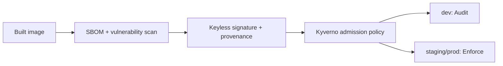

# Ticket 06 supply-chain contract

<!-- security-10042026-Maurice: admission is credential-free and environment policy is explicit. -->

This shared GitOps layer contains Kyverno admission policy and Trivy Operator
configuration. The manual workflow uses provider OIDC/workload federation only;
it emits SBOMs, Trivy evidence, keyless Cosign signatures, and provenance for
immutable digests. Staging and production are promoted by reviewed PRs.

Exceptions require `exception.schema.json`, two reviewers, an owner,
compensating control, exact resources, and a UTC expiry of at most seven days.
Expired exceptions are invalid and are never renewed automatically. Dev uses
Audit; staging and prod use Enforce.

## Status and architecture

Live URL: **Not deployed**. This subtree is an unprovisioned contract; repository validation does not contact providers or apply infrastructure.

The canonical operational context, safety/no-apply stance, ownership, recovery
boundaries, and update instructions are in [`platform/README.md`](../README.md)
(or `../../README.md` for nested Terraform modules). No diagram here is evidence
of a live deployment.
