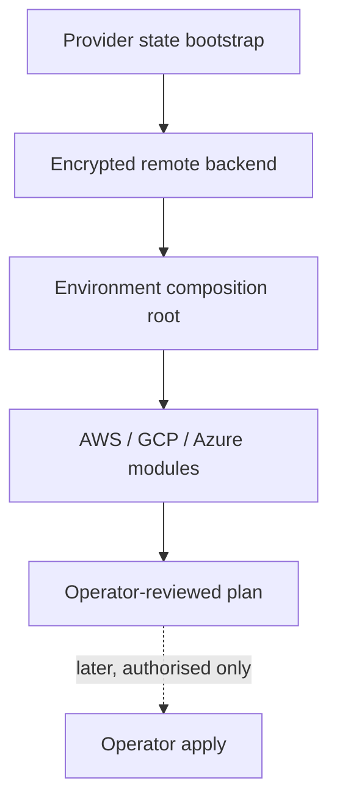

# Cloud-native Terraform foundation

These modules are deployment-ready but intentionally unprovisioned. They cover AWS,
GCP, and Azure without embedding credentials, account IDs, domains, or state secrets.

## Safe repository validation (no provider calls and no apply)

Run these checks from the repository root. They validate syntax and module
interfaces only; they do not bootstrap state, contact a provider, create a
cluster, or apply infrastructure:

```sh
terraform -chdir=platform/terraform/state/aws init -backend=false
terraform -chdir=platform/terraform/state/aws validate
terraform -chdir=platform/terraform/state/gcp init -backend=false
terraform -chdir=platform/terraform/state/gcp validate
terraform -chdir=platform/terraform/state/azure init -backend=false
terraform -chdir=platform/terraform/state/azure validate
terraform -chdir=platform/terraform/hetzner init -backend=false
terraform -chdir=platform/terraform/hetzner validate
```

The AWS/GCP/Azure cluster directories are reusable modules, not executable
composition roots in this checkout. Do not invent a root or claim a cloud plan;
the only executable cluster root here is `platform/terraform/hetzner`.

## Operator-only plan and later apply (not run by this repository)

An authorised operator must first choose an isolated working directory outside
Git, copy the matching example, and provide only non-secret names/locations as
variables. Provider authentication must come from local provider tooling or
OIDC; never paste credentials into files or commands. These are exact plan-only
commands for the separate state bootstrap roots:

```sh
mkdir -p "$PLATFORM_WORKDIR/state/aws" "$PLATFORM_WORKDIR/state/gcp" "$PLATFORM_WORKDIR/state/azure"
cp platform/terraform/state/aws/backend.hcl.example "$PLATFORM_WORKDIR/state/aws/backend.hcl"
cp platform/terraform/state/gcp/backend.hcl.example "$PLATFORM_WORKDIR/state/gcp/backend.hcl"
cp platform/terraform/state/azure/backend.hcl.example "$PLATFORM_WORKDIR/state/azure/backend.hcl"

terraform -chdir=platform/terraform/state/aws plan -input=false \
  -var='region=replace-with-region' \
  -var='bucket_name=replace-with-globally-unique-state-bucket' \
  -out="$PLATFORM_WORKDIR/state/aws/bootstrap.tfplan"
terraform -chdir=platform/terraform/state/gcp plan -input=false \
  -var='project_id=replace-with-project-id' \
  -var='bucket_name=replace-with-globally-unique-state-bucket' \
  -var='location=US' \
  -out="$PLATFORM_WORKDIR/state/gcp/bootstrap.tfplan"
terraform -chdir=platform/terraform/state/azure plan -input=false \
  -var='resource_group_name=replace-with-resource-group' \
  -var='location=replace-with-region' \
  -var='storage_account_name=replace-with-globally-unique-name' \
  -var='container_name=tfstate' \
  -out="$PLATFORM_WORKDIR/state/azure/bootstrap.tfplan"
```

The required examples are `state/aws/backend.hcl.example`,
`state/gcp/backend.hcl.example`, `state/azure/backend.hcl.example`, and
`hetzner/terraform.tfvars.example`. The backend examples require, respectively,
AWS `bucket/key/region/use_lockfile`, GCP `bucket/prefix`, and Azure
`resource_group_name/storage_account_name/container_name/key`. After a state
bootstrap is separately approved, an operator creates an environment
composition root (not present in this checkout), copies
`platform/terraform/backend.hcl.example` to an ignored operator path, fills the
matching backend values, and runs `terraform init -backend-config=/path/to/backend.hcl`
followed by a reviewed `terraform plan`. Only that authorised operator may run
`terraform apply <reviewed-plan-file>`; this repository does not run apply.

State bootstrap is deliberately separate from backend consumption. Bootstrap resources
are idempotent and use stable names; environment roots only consume an already-created
backend.

All provider versions are pinned in `versions.tf`. Private networking, encryption,
backups, workload identity, and three-zone defaults are enabled by default. CDN/WAF
resources are optional and disabled by default.

## Status and architecture

Live URL: **Not deployed**. This subtree is an unprovisioned contract; repository validation does not contact providers or apply infrastructure.



The canonical operational context, safety/no-apply stance, ownership, recovery
boundaries, and update instructions are in [`platform/README.md`](../README.md)
(or `../../README.md` for nested Terraform modules). No diagram here is evidence
of a live deployment.
