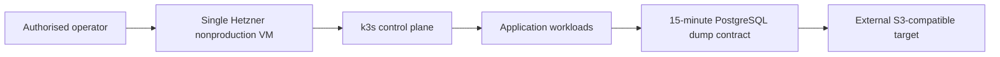

# Hetzner k3s nonproduction foundation

This is a **single-node, nonproduction-only** Terraform subtree. It uses only
Hetzner Cloud, creates a private network, and opens SSH only to the supplied
operator CIDRs plus public HTTP/HTTPS. Kubernetes API access is private-network
only. No provider API is called by repository validation.

## Inputs and credentials

Copy `terraform.tfvars.example` to a local ignored file and provide the Hetzner
token through `TF_VAR_hcloud_token` or a secret manager. The example contains
placeholders only. `ssh_public_key` is required; never put a private key or API
token in Terraform files, logs, or CI output. The generated k3s token is stored
in Terraform state, so state must be treated as sensitive.

## Bootstrap and Helm values

The server cloud-init pins k3s to the Kubernetes 1.35 line (`v1.35.9+k3s1`).
This exact stable release is verified in the official k3s release list (published
2026-09-30): https://github.com/k3s-io/k3s/releases/tag/v1.35.9%2Bk3s1.
installs no production ingress, and optionally mounts one ext4 volume at
`/var/lib/ecommerce-data`. After bootstrap, use the existing chart with
`platform/charts/aguda-deskworks/values-k3s.yaml`. That overlay declares
nonproduction in-cluster PostgreSQL and standalone Redis persistence using
`local-path`, plus explicit backup hook examples. The hook commands are
examples only: provide secrets, test restores, and choose operator-owned backup
storage before any teardown. In-cluster data is not a production durability
boundary.

The `kubeconfig` output is sensitive but intentionally uses a temporary
`insecure-skip-tls-verify` representation for nonproduction convenience. Prefer
the `canonical_kubeconfig_command` output and retrieve the CA-bearing k3s file
over SSH; Terraform never prints the sensitive output.

## Lifecycle

1. `terraform init -backend=false` and `terraform validate` are local checks.
2. Configure a separately secured state backend before an operator runs apply.
3. Review firewall CIDRs, the bootstrap version, and backup evidence before
   manually applying this nonproduction stack.
4. For an upgrade, change `kubernetes_version` only within the validated 1.35
   line, drain workloads, snapshot/backup PostgreSQL and Redis, then apply and
   verify `kubectl get nodes` and application readiness. Do not use this subtree
   as a production upgrade path.
5. Before teardown, run and verify the backup hooks, export required data, and
   remove the Helm release. `terraform destroy` removes the server, network,
   firewall, and optional volume; volume data is not recoverable afterward.

Production is rejected by variable validation and a Terraform precondition.

## Status and architecture

Live URL: **Not deployed**. This subtree is an unprovisioned contract; repository validation does not contact providers or apply infrastructure.

The canonical operational context, safety/no-apply stance, ownership, recovery
boundaries, and update instructions are in [`platform/README.md`](../../README.md)
(or `../../README.md` for nested Terraform modules). No diagram here is evidence
of a live deployment.
