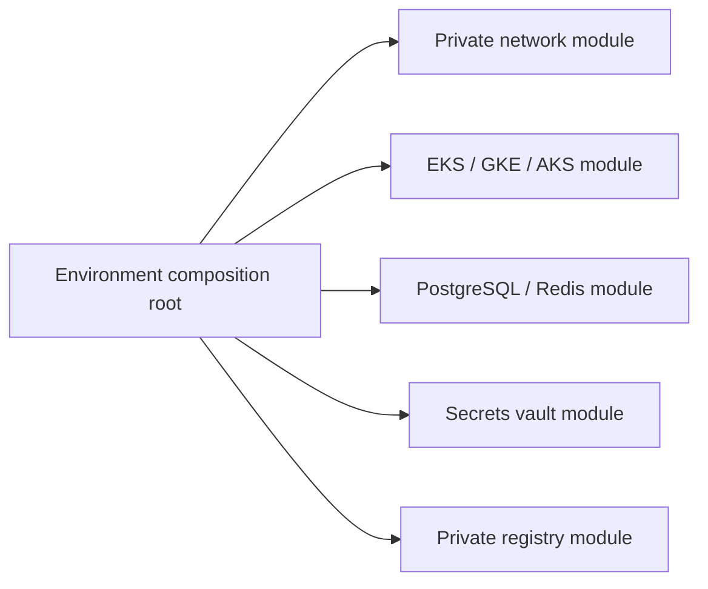

# Module interface

Each provider exposes the same conceptual seams: `network`, cluster (`eks`, `gke`,
`aks`), `registry`, `data`, `vault`, `dns`, and optional `edge`. Cluster modules emit
cluster identity, endpoint, and workload-identity/OIDC outputs; data modules emit
private PostgreSQL and Redis endpoints; registry modules emit an image repository
endpoint. Endpoint and kubeconfig outputs that can be sensitive are marked sensitive.

## Status and architecture

Live URL: **Not deployed**. This subtree is an unprovisioned contract; repository validation does not contact providers or apply infrastructure.

The canonical operational context, safety/no-apply stance, ownership, recovery
boundaries, and update instructions are in [`platform/README.md`](../../README.md)
(or `../../README.md` for nested Terraform modules). No diagram here is evidence
of a live deployment.
