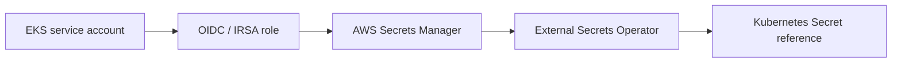

# AWS vault seam

Use AWS Secrets Manager or an approved external-secrets integration at deployment
time. This module intentionally contains no secret values or provider credentials.
The stable interface is `secret_arns` supplied by the environment composition root.

## Status and architecture

Live URL: **Not deployed**. This subtree is an unprovisioned contract; repository validation does not contact providers or apply infrastructure.

The canonical operational context, safety/no-apply stance, ownership, recovery
boundaries, and update instructions are in [`platform/README.md`](../../../../README.md)
(or `../../README.md` for nested Terraform modules). No diagram here is evidence
of a live deployment.
