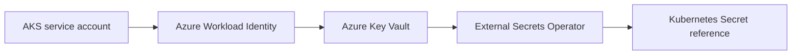

# Azure vault seam

Use Key Vault with AKS Workload Identity. This placeholder exposes only secret
identifiers and never accepts secret material.

## Status and architecture

Live URL: **Not deployed**. This subtree is an unprovisioned contract; repository validation does not contact providers or apply infrastructure.

The canonical operational context, safety/no-apply stance, ownership, recovery
boundaries, and update instructions are in [`platform/README.md`](../../../../README.md)
(or `../../README.md` for nested Terraform modules). No diagram here is evidence
of a live deployment.
