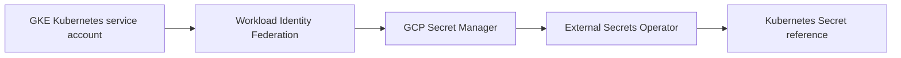

# GCP vault seam

Use Secret Manager with Workload Identity Federation. Secret values are intentionally
not represented in Terraform variables, state examples, or this repository.

## Status and architecture

Live URL: **Not deployed**. This subtree is an unprovisioned contract; repository validation does not contact providers or apply infrastructure.

The canonical operational context, safety/no-apply stance, ownership, recovery
boundaries, and update instructions are in [`platform/README.md`](../../../../README.md)
(or `../../README.md` for nested Terraform modules). No diagram here is evidence
of a live deployment.
