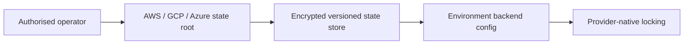

# Remote state bootstrap (separate root)

Run exactly one provider-specific bootstrap root before consuming a backend. These
roots create encrypted, private, versioned state storage and are safe to re-run.
AWS uses native S3 lockfiles (`use_lockfile = true`), GCS uses generation preconditions,
and AzureRM uses blob leases. No credentials or cloud identifiers are stored here.

## Status and architecture

Live URL: **Not deployed**. This subtree is an unprovisioned contract; repository validation does not contact providers or apply infrastructure.

## Required inputs and safe plan commands

Use the corresponding root only from an authorised operator workstation. The
commands below are plan-only and require provider-native local authentication or
OIDC; they contain no credentials. Run repository validation separately with
`terraform -chdir=platform/terraform/state/<provider> init -backend=false` and
`validate`; that validation never creates state storage.

| Root | Required variables | Backend example |
|---|---|---|
| `state/aws` | `region`, `bucket_name` | `state/aws/backend.hcl.example` |
| `state/gcp` | `project_id`, `bucket_name`; optional `location`, `kms_key_name` | `state/gcp/backend.hcl.example` |
| `state/azure` | `resource_group_name`, `location`, `storage_account_name`; optional `container_name` | `state/azure/backend.hcl.example` |

There are no executable AWS/GCP/Azure cluster roots in this checkout. The
cluster modules are consumed by a future composition root at
`terraform/modules/aws/eks`, `terraform/modules/gcp/gke`, or
`terraform/modules/azure/aks`; their required interface examples are kept in
the corresponding `variables.tf` files (AWS: `name`, `private_subnet_ids`,
`node_role_arn`, `kms_key_arn`; GCP: `name`, `project_id`, `region`,
`network_id`, `subnetwork_id`; Azure: `name`, `location`,
`resource_group_name`, `subnet_id`). This repository therefore validates those
modules through its platform validator but does not provide a cluster plan or
apply command for them.

```sh
export PLATFORM_WORKDIR=/absolute/path/outside/this/repository
terraform -chdir=platform/terraform/state/aws plan -input=false -var='region=replace-with-region' -var='bucket_name=replace-with-unique-name' -out="$PLATFORM_WORKDIR/aws-state.tfplan"
terraform -chdir=platform/terraform/state/gcp plan -input=false -var='project_id=replace-with-project-id' -var='bucket_name=replace-with-unique-name' -var='location=US' -out="$PLATFORM_WORKDIR/gcp-state.tfplan"
terraform -chdir=platform/terraform/state/azure plan -input=false -var='resource_group_name=replace-with-resource-group' -var='location=replace-with-region' -var='storage_account_name=replace-with-unique-name' -var='container_name=tfstate' -out="$PLATFORM_WORKDIR/azure-state.tfplan"
```

The operator must review each plan before any later apply. This checkout does
not bootstrap state, consume a remote backend, or execute apply.



The canonical operational context, safety/no-apply stance, ownership, recovery
boundaries, and update instructions are in [`platform/README.md`](../../README.md)
(or `../../README.md` for nested Terraform modules). No diagram here is evidence
of a live deployment.
