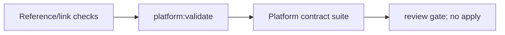

# Platform validation seam

Live URL: **Not deployed**. The validation seam is local and does not contact
cloud, cluster, GitHub, or external providers.

Run `corepack pnpm platform:validate` from the repository root. It first checks
CSV-to-artifact references, then runs the structured platform suite. Failures are
actionable file/contract failures; successful validation is not deployment or
restore evidence. Traces are structured and must be inspected for secrets before
retention.

Native DevSecOps tools are mandatory, pinned, checksum-verified, and cached only
under the OS temp directory: TFLint 0.59.1, Checkov 3.2.455, kubeconform 0.7.0,
Kyverno CLI 1.15.2, and actionlint 1.7.7. Missing, unverifiable, or failed tools
fail the command; repository heuristics cannot substitute for them. Kubeconform
uses pinned Kubernetes 1.35.0 schemas. The explicit `ServiceMonitor` skip is an
operator-owned CRD boundary external to this chart and is logged; rendered
resources remain covered by Kyverno policy validation.
